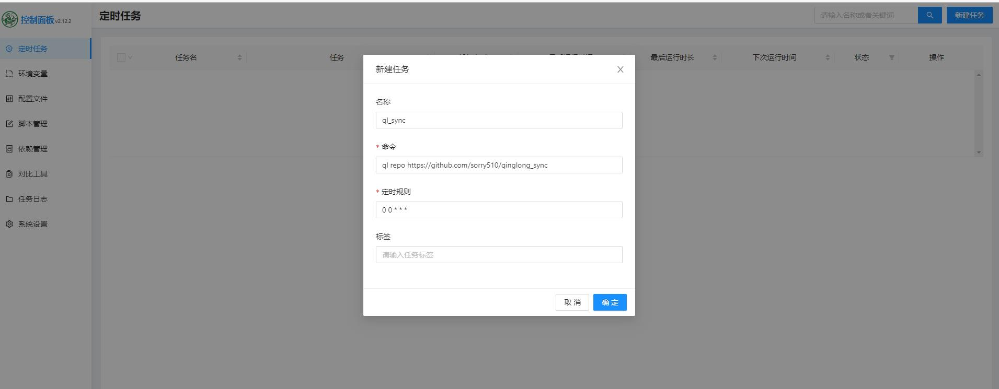

## 脚本功能
> 建议青龙版本 v2.12.2

### 同步青龙系统(A)的配置到青龙系统(B)

- 环境变量(多次同步，会因为重复失败)
- 配置文件(可以多次同步，更新为最新配置)
- 依赖管理(多次同步，会重复安装多次，版本需要>=v2.12.2)

## 使用说明

### 在A和B分别创建应用获取 Client ID 和 Client Secret
> 记录 Client ID 和 Client Secret 后面需要用到


### 在B中配置环境变量
>在[配置文件]菜单 的 config.sh 中添加如下配置或在环境变量中添加配置

|  变量名   | 变量说明  | 默认值  | 是否必填  |
|  ----  | ----  | ----  | ----  |
| ql_origin_url  | A的url| None  | 是 |
| ql_origin_client_id  | A的Client ID | None   | 是 |
| ql_origin_client_secret  | A的Client Secret | None   | 是 |
| ql_target_url  | B的url| None  | 是 |
| ql_target_client_id  | B的Client ID | None   | 是 |
| ql_target_client_secret  | B的Client Secret | None   | 是 |
| ql_sync_env  | 是否同步环境变量(默认同步) | "true"   | 否 |
| ql_sync_config  | 是否同步配置文件(默认同步) | "true"   | 否 |
| ql_sync_dependence  | 是否同步依赖管理(默认同步) | "true"   | 否 |
| ql_sync_proxy  | 配置代理(默认不用代理，如何使用参考python 的 requests proxy) | None  | 否 |

#### 例子:
> 在B中[配置文件]菜单的 config.sh 中添加如下配置
> 注意同步完成后，下面这些配置会被A覆盖

```
## sync qinglong
export ql_origin_url = "http://A地址"
export ql_origin_client_id = "xxx"
export ql_origin_client_secret = "xxx"

export ql_target_url = "http://A地址"
export ql_target_client_id = "xxx"
export ql_target_client_secret = "xxx"
```


#### 添加定时任务



> 其中命令为

```
ql repo https://github.com/sorry510/qinglong_sync
```

> 运行一次这个任务，刷新页面，可以获取同步脚本


> 运行一次 `qinglong_sync.py` 这个任务, 就可以完成同步
>ps: 注意完成同步后删除或禁用这2个定时任务，否则会发生多次同步
